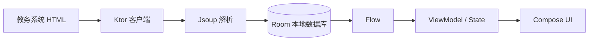

<div align="center">


# 闪电课表

原生 Android 课表工具，为吉首大学学生打造
<br/>登录一次，课表、考试、成绩、第二课堂全部装进手机

</div>

---

## 功能特性

**课表**

- 周视图展示，支持学期切换与当前周自动定位
- 手动添加课程、编辑课程信息、自定义课程颜色
- 手动课程与教务课程合并去重，删除教务课程时保留手动记录
- 导出为 ICS 日历文件，可分享到其他日历应用

**成绩与考试**

- 成绩按学期筛选，自动计算学分加权 GPA
- 考试按倒计时排序，临近考试一眼可见

**校园服务**

- 第二课堂活动入口
- 可信电子凭证（服务列表、模板、订单、PDF 预览）

**使用体验**

- 深色模式，跟随系统或手动切换
- 课程提醒通知：WorkManager 定期同步 + AlarmManager 精确闹钟
- 应用内更新，Release 走 HTTPS manifest，Debug 可接本地更新服务器
- 手机竖屏、平板与横屏自适应布局

**两种登录方式**

| 方式 | 说明 | 可用范围 |
|---|---|---|
| `PORTAL` | CAS 统一身份认证 | 课表 / 成绩 / 考试 / 第二课堂 / 电子凭证 |
| `JWXT_DIRECT` | 直接登录教务系统 | 课表 / 成绩 / 考试 |

## 技术栈

| 领域 | 选型 |
|---|---|
| 语言 | Kotlin 2.0.21 |
| UI | Jetpack Compose + Material 3 |
| 架构 | 多模块 Gradle（17 个模块），手动依赖注入 |
| 网络 | Ktor Client + OkHttp engine |
| 解析 | Jsoup |
| 存储 | Room（本地数据库）、DataStore（偏好） |
| 安全 | AndroidX Security Crypto（凭据加密存储） |
| 异步 | kotlinx-coroutines + Flow |
| 后台 | WorkManager、AlarmManager |

构建要求：**JDK 17+**，Gradle 8.13 / AGP 8.13.2。
`minSdk 24`（Android 7.0）、`targetSdk 34`、`compileSdk 36`。

## 模块结构

```
app/                     应用入口：Application、MainActivity、导航、通知运行时
core/
  model/                 纯 Kotlin 数据模型（无 Android 依赖）
  common/                通用工具
  database/              Room 数据库（Entity / DAO / 迁移）
  datastore/             DataStore 偏好 + 加密凭据存储
  network/               Ktor 客户端 + Jsoup HTML 解析 + 双会话管理
  data/                  Repository 契约、同步协调、课表合并
  designsystem/          主题、图标、颜色、通用控件
  ui/                    共享 Compose 组件（课表网格、自适应布局）
  update/                应用内更新（检查 / 下载 / 校验 / 安装）
feature/
  auth/                  登录页
  schedule/              课表页（周视图、课程编辑、学期切换、ICS 导出）
  grades/                成绩页（学期筛选、统计分析）
  exams/                 考试页（倒计时排序）
  profile/               个人中心、课表管理、第二课堂
  settings/              设置、通知设置、隐私政策、开源许可
  credential/            可信电子凭证
```

依赖方向：`feature/* → core/data → core/{model, common, network}`，
`core/database → core/data`，`app` 作为组合根汇聚全部模块。

数据流向：



## 快速开始

克隆仓库后直接构建 Debug 包，**不需要任何额外配置**：

```bash
./gradlew assembleDebug
```

产物在 `app/build/outputs/apk/debug/app-debug.apk`。

运行单元测试（纯 JVM 测试，不需要设备或模拟器）：

```bash
./gradlew test
```

清理构建：

```bash
./gradlew clean
```

### Release 构建

Release 需要签名与更新服务配置，两个文件都在 `.gitignore` 中，不会被提交：

```bash
cp keystore.properties.example keystore.properties   # 填入签名库路径与密码
cp update.properties.example  update.properties      # 填入 manifest 与发布地址
./gradlew assembleRelease
```

缺少 `keystore.properties` 时 Debug 仍可构建，但任何名称含 `Release` 的任务都会明确失败——避免误用调试签名发布。

详细的更新服务搭建步骤见 [`docs/UPDATE_SERVICE_CONFIGURATION.md`](docs/UPDATE_SERVICE_CONFIGURATION.md)，
新手向的分步指南见 [`docs/UPDATE_SERVICE_BEGINNER_GUIDE.md`](docs/UPDATE_SERVICE_BEGINNER_GUIDE.md)。

## 数据与隐私

- 教务账号密码经 AndroidX Security Crypto 加密后存储在本地，不上传任何第三方服务器
- 登录与同步时，必要信息通过 HTTPS **直接发送至学校教务系统或统一身份认证系统**
- 首次启动须同意隐私政策才会启用在线功能；撤销同意会清除本机所有在线数据
- 应用不接入广告、用户画像或行为分析 SDK
- 完整的第三方依赖许可证见 [`THIRD_PARTY_LICENSES.md`](THIRD_PARTY_LICENSES.md)，应用内「设置 → 开源许可」可查看全文

## 致谢

课表界面、交互方式与部分功能设计参考了
[WakeUp课程表（WakeupSchedule_Kotlin）](https://github.com/YZune/WakeupSchedule_Kotlin)
（Apache-2.0，作者 YZune 及贡献者）。原项目声明允许借鉴并希望在作品中作出说明，
本项目已在应用内「设置 → 开源许可」提供特别致谢、原项目链接与许可证全文入口。

## 免责声明

本项目是**个人开发者维护的非官方应用**，不代表吉首大学或任何校内单位作出承诺。

源代码公开仅供学习与交流。使用时请注意：

- 遵守学校教务系统与统一身份认证系统的使用规范
- 不要对学校系统进行高频请求或压力测试
- 因使用、修改或二次分发本代码造成的任何影响，由使用者自行承担

## 许可证

本项目基于 [Apache License 2.0](LICENSE) 开源。

第三方组件的许可证清单见 [`THIRD_PARTY_LICENSES.md`](THIRD_PARTY_LICENSES.md)。
